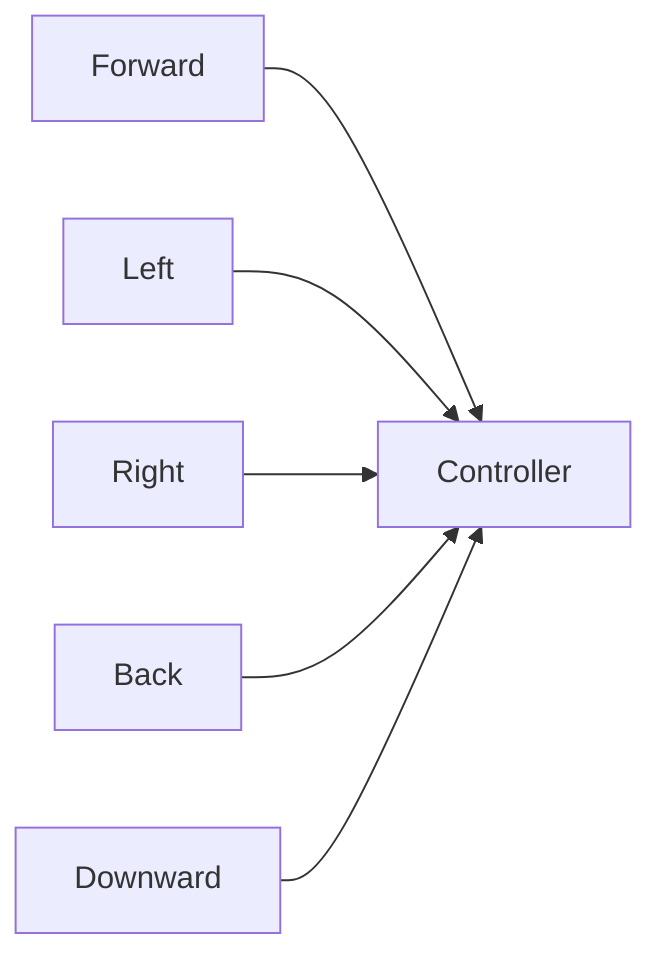

# SkySonar: Directional Ultrasonic Sensor Node for Robotics & Drones

[](https://github.com/Adem-Aoun/SkySonar/actions)
[](LICENSE)
[](https://docs.ros.org)

**ESP32-based directional ultrasonic sensor platform with adaptive Kalman filtering and FreeRTOS scheduling**

---

## 📋 Table of Contents

1. [Coverage Pattern](#coverage-pattern)
2. [System Architecture](#system-architecture)
3. [Real-Time OS Implementation](#real-time-os-implementation)
4. [Kalman Filter Algorithm](#kalman-filter-algorithm)
5. [Hardware Setup](#hardware-setup)
6. [PlatformIO Build & Deployment](#platformio-build--deployment)
7. [ROS 2 Subscriber Examples](#ros-2-subscriber-examples)
8. [API Reference](#api-reference)
9. [Troubleshooting](#troubleshooting)
10. [License](#license)

---

## 1. Coverage Pattern <a name="coverage-pattern"></a>

5-directional sensing configuration:


**Key Specifications**:
- Angular resolution: 5 discrete directions
- Range: 2cm to 4m
- Update rate: 20Hz (50ms cycle)

---

## 2. System Architecture <a name="system-architecture"></a>

```mermaid
flowchart TB
    S1[Downward Sensor\nHC-SR04] --> SP
    S2[Forward Sensor\nHC-SR04] --> SP
    S3[Left Sensor\nHC-SR04] --> SP
    S4[Right Sensor\nHC-SR04] --> SP
    S5[Back Sensor\nHC-SR04] --> SP

    subgraph ESP32[ESP32-WROOM]
        direction TB
        SP[Sensor Polling Task\nFreeRTOS Prio 3\n20Hz\n<5ms] -->|Raw Measurements| B[Double-Buffered\nData Store]
        B --> KF[Kalman Filter Task\nFreeRTOS Prio 3\n20Hz\n1-2ms/sensor]
        KF -->|Adaptive Filtering\nQ/R Noise Tuning| F[Filtered Data\nRing Buffer]
        F --> RP[ROS Publishing Task\nFreeRTOS Prio 2\n20Hz\n<5ms]
        RP -->|Micro-ROS| M
    end

    M[micro-ROS Client\nSerial/UDP] --> R[ROS 2 Agent]
    R --> T1[/ultrasonic_sensor/downward/filtered\nsensor_msgs/Range]
    R --> T2[/ultrasonic_sensor/forward/filtered\nsensor_msgs/Range]
    R --> T3[/ultrasonic_sensor/left/filtered\nsensor_msgs/Range]
    R --> T4[/ultrasonic_sensor/right/filtered\nsensor_msgs/Range]
    R --> T5[/ultrasonic_sensor/back/filtered\nsensor_msgs/Range]
    
    classDef sensor fill:#e6f7ff,stroke:#1890ff;
    classDef task fill:#f6ffed,stroke:#52c41a;
    classDef buffer fill:#f9f0ff,stroke:#722ed1;
    classDef ros fill:#fff7e6,stroke:#fa8c16;
    class S1,S2,S3,S4,S5 sensor;
    class SP,KF,RP task;
    class B,F buffer;
    class M,R,T1,T2,T3,T4,T5 ros;
```

---

## 3. Real-Time OS Implementation <a name="real-time-os-implementation"></a>

### FreeRTOS Task Scheduling
| Task               | Priority | Frequency | Execution Time | Description                     |
|--------------------|----------|-----------|----------------|---------------------------------|
| `SensorPollTask`   | 3 (High) | 20Hz      | 5-10ms         | Reads all 5 sensors sequentially|
| `KalmanFilterTask` | 3 (High) | 20Hz      | 1-2ms/sensor   | Processes each sensor reading   |
| `PublishTask`      | 2        | 20Hz      | 3-5ms          | Publishes to ROS topics         |
| `MainLoop`         | 1 (Low)  | 10Hz      | Variable       | Services and diagnostics        |

### Inter-Task Communication
```c
// Shared data protection
xSemaphoreTake(data_mutex, portMAX_DELAY);
// Critical section: Update sensor data
xSemaphoreGive(data_mutex);

// Task synchronization
xTaskNotifyGive(KalmanFilterTask);  // Trigger after sensor read
```

---

## 4. Kalman Filter Algorithm <a name="kalman-filter-algorithm"></a>

### Core Filter Equations
```math
\begin{align*}
\text{Prediction:} & \\
x_{\text{prior}} &= x_{\text{prev}} \\
P_{\text{prior}} &= P_{\text{prev}} + Q \\
\\
\text{Update:} & \\
K &= \frac{P_{\text{prior}}}{P_{\text{prior}} + R} \\
x &= x_{\text{prior}} + K(z - x_{\text{prior}}) \\
P &= (1 - K)P_{\text{prior}}
\end{align*}
```

### Adaptive Noise Tuning
```math
\begin{align*}
\text{Innovation:} & \quad \epsilon = z - x_{\text{prior}} \\
\text{Measurement Noise:} & \quad R = (1 - \alpha)R_{\text{prev}} + \alpha \epsilon^2 \\
\text{Process Noise:} & \quad Q = \max(0.001, 0.1 \times \sigma^2_{\text{window}})
\end{align*}
```

**Implementation Details**:
- **Sliding Window**: Maintains last 10 innovations for variance calculation
- **Exponential Smoothing**: α = 0.01 for gradual noise adaptation
- **State Initialization**: Auto-initializes on first valid measurement
- **NaN Handling**: Bypasses filter during invalid readings

---

## 7. ROS 2 Subscriber Examples <a name="ros-2-subscriber-examples"></a>

### Basic Distance Monitor Node
```python
#!/usr/bin/env python3
import rclpy
from rclpy.node import Node
from sensor_msgs.msg import Range

class SensorMonitor(Node):
    def __init__(self):
        super().__init__('sensor_monitor')
        self.subscriptions = []
        
        # Create subscribers for all directions
        directions = ['downward', 'forward', 'left', 'right', 'back']
        for dir in directions:
            sub = self.create_subscription(
                Range,
                f'/ultrasonic_sensor/{dir}/filtered',
                lambda msg, d=dir: self.sensor_callback(msg, d),
                10
            )
            self.subscriptions.append(sub)
        
        self.get_logger().info("Sensor monitor started")

    def sensor_callback(self, msg, direction):
        if not math.isnan(msg.range):
            self.get_logger().info(
                f"{direction.capitalize()}: {msg.range:.2f}m",
                throttle_duration_sec=1  # Limit to 1Hz output
            )

def main():
    rclpy.init()
    node = SensorMonitor()
    try:
        rclpy.spin(node)
    except KeyboardInterrupt:
        pass
    finally:
        node.destroy_node()
        rclpy.shutdown()

if __name__ == '__main__':
    main()
```
## 8. API Reference <a name="api-reference"></a>

### ROS 2 Topics
| Topic | Type | Description | QoS |
|-------|------|-------------|-----|
| `/ultrasonic_sensor/downward/filtered` | `sensor_msgs/Range` | Downward distance (m) | Best effort |
| `/ultrasonic_sensor/forward/filtered` | `sensor_msgs/Range` | Forward distance (m) | Best effort |
| `/ultrasonic_sensor/left/filtered` | `sensor_msgs/Range` | Left distance (m) | Best effort |
| `/ultrasonic_sensor/right/filtered` | `sensor_msgs/Range` | Right distance (m) | Best effort |
| `/ultrasonic_sensor/back/filtered` | `sensor_msgs/Range` | Back distance (m) | Best effort |
| `/diagnostics` | `diagnostic_msgs/DiagnosticStatus` | System health | Reliable |

### Service
| Service | Type | Description |
|---------|------|-------------|
| `/servo_cam_service` | `servocam_interfaces/srv/Servocam` | Pan/tilt control |

---

## 9. Troubleshooting <a name="troubleshooting"></a>

11. Troubleshooting 
No ROS 2 topicsCause: micro-ROS agent not running or wrong portSolution: Start agent with:
```bash

ros2 run micro_ros_agent micro_ros_agent serial --dev /dev/ttyUSB0 -b115200
```
Intermittent readingsCause: Voltage divider mismatch or loose wiringSolution: Verify 1 kΩ/2 kΩ resistor divider and secure all sensor connections.

Slow Kalman convergenceCause: Low adaptation rate (α too small)Solution: Increase α in code (e.g., from 0.01 to 0.02).

Over-filteringCause: Minimum process noise (Q_min) too lowSolution: Raise Q_min (e.g., from 0.001 to 0.01).

Noise spikesCause: Sliding window size too smallSolution: Increase WINDOW_SIZE (e.g., from 10 to 20 samples).

RTOS preemption lagCause: Priority inversion or misconfigured task prioritiesSolution: Ensure FreeRTOS priorities: SensorTask (highest) > PublishTask > main loop.

Servo no responseCause: PWM duty change below detection thresholdSolution: Guarantee angle commands result in ≥10 duty unit change

## License <a name="license"></a>
MIT © Adem Oussama 
```
