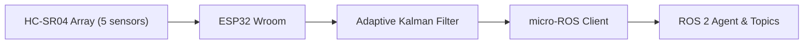
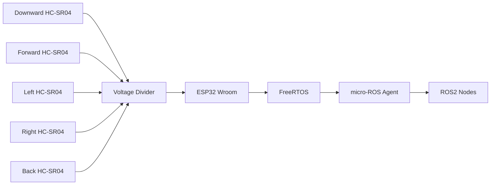
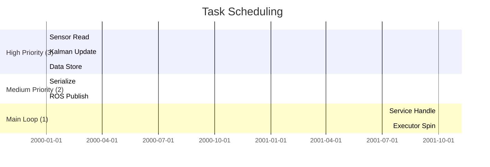

# SkySonar

[](https://github.com/Adem-Aoun/SkySonar/actions)
[](LICENSE)

**ESP32-based multi-directional ultrasonic sensor node for micro‑ROS**

SkySonar provides deterministic range sensing with adaptive filtering and ROS 2 integration. It features:

* Five HC‑SR04 sensors arranged omnidirectionally
* Real-time Kalman filtering with adaptive noise estimation
* FreeRTOS task prioritization for sensor polling (high) and publishing (medium)
* Servo control via ROS 2 services
* Diagnostic monitoring and hardware validation

---

## 📋 Table of Contents

1. [Introduction](#introduction)
2. [System Architecture](#system-architecture)
3. [Electronics Design](#electronics-design)
4. [Software Architecture](#software-architecture)
5. [Kalman Filter Algorithm](#kalman-filter-algorithm)
6. [Hardware Setup](#hardware-setup)
7. [PlatformIO Build & Deployment](#platformio-build--deployment)
8. [Operation & Validation](#operation--validation)
9. [API Reference](#api-reference)
10. [Troubleshooting](#troubleshooting)
11. [License](#license)

---

## 1. Introduction <a name="introduction"></a>

SkySonar delivers high-fidelity range measurements for robotics via five HC‑SR04 modules. Its core strengths:

* **Adaptive Kalman Filter**: Runtime-tuned Q/R noise covariances
* **FreeRTOS**: Deterministic task scheduling for sensing and publishing
* **micro-ROS**: Native ROS 2 topics and services

## 2. System Architecture <a name="system-architecture"></a>





````

## 3. Electronics Design <a name="electronics-design"></a>
**Voltage Divider**  
5 V echo → R1 (1.8 kΩ) → node → R2 (3.3 kΩ) → GND  
```math
V_out = V_in × R2/(R1+R2) ≈ 5 V × 3.3/5.1 ≈ 3.2 V
````

## 4. Software Architecture <a name="software-architecture"></a>

### Includes & Dependencies

```cpp
#include <Arduino.h>
#include <NewPing.h>
#include <micro_ros_platformio.h>
#include <rcl/rcl.h>
#include <rclc/rclc.h>
#include <rclc/executor.h>
#include <sensor_msgs/msg/range.h>
#include <diagnostic_msgs/msg/diagnostic_status.h>
#include <freertos/FreeRTOS.h>
#include <freertos/task.h>
#include <freertos/semphr.h>
#include <driver/ledc.h>
#include <servocam_interfaces/srv/servocam.h>
#include <math.h>
```

### FreeRTOS Task Prioritization

| Task                 | Priority | Interval      | Responsibilities                                         |
| -------------------- | -------- | ------------- | -------------------------------------------------------- |
| Sensor Reading Task  | 3        | 50 ms (20 Hz) | Ping sensors, apply Kalman filter, store results         |
| Publishing Task      | 2        | 50 ms (20 Hz) | Serialize and publish raw/filtered Range messages        |
| Main Loop / Executor | 1        | \~10 ms spin  | Handle ROS2 services, publish diagnostics, executor loop |



### Inter-task Synchronization

```c
// Protect readings[] arrays
xSemaphoreTake(data_mutex, portMAX_DELAY);
// update shared data
xSemaphoreGive(data_mutex);
```

## 5. Kalman Filter Algorithm <a name="kalman-filter-algorithm"></a>

**Prediction**:

```
x_prior = x_prev
P_prior = P_prev + Q_prev
```

**Update**:

```
K = P_prior/(P_prior+R_prev)
x = x_prior + K*(z - x_prior)
P = (1-K)*P_prior
```

**Adaptive Noise**:

```
Innovation = z - x_prior
R = (1-α)R_prev + α·Innovation², α=0.01
Q = max(0.001, variance(window)*0.1)
```

## 6. Hardware Setup <a name="hardware-setup"></a>

| Sensor   | TRIG | ECHO |
| -------- | ---- | ---- |
| Downward | 4    | 16   |
| Forward  | 17   | 14   |
| Left     | 18   | 22   |
| Right    | 32   | 35   |
| Back     | 21   | 25   |

## 7. PlatformIO Build & Deployment <a name="platformio-build--deployment"></a>

```ini
[env:upesy_wroom]
platform = espressif32
board = upesy_wroom
framework = arduino
lib_deps =
  teckel12/NewPing@^1.9.7
  micro-ROS/micro_ros_platformio@^0.4.0
```

## 8. Operation & Validation <a name="operation--validation"></a>

1. Start agent: `ros2 run micro_ros_agent micro_ros_agent serial --dev /dev/ttyUSB0 -b 115200`
2. Inspect: `ros2 topic echo /ultrasonic_sensor/downward/filtered`
3. Service: `ros2 service call /servo_cam_service servocam_interfaces/srv/Servocam "{angle_deg:45.0}"`

## 9. API Reference <a name="api-reference"></a>

* `/ultrasonic_sensor/<name>/raw`
* `/ultrasonic_sensor/<name>/filtered`
* `/diagnostics`
* `/servo_cam_service`

## 10. Troubleshooting <a name="troubleshooting"></a>

* No topics → check agent connection
* Unstable readings → verify voltage dividers

## 11. License <a name="license"></a>

MIT © 
