I'll improve the README.md with a comprehensive system diagram and fix the voltage divider section. Here's the enhanced documentation:

```markdown
# SkySonar

[](https://github.com/Adem-Aoun/SkySonar/actions)
[](LICENSE)

**ESP32-based multi-directional ultrasonic sensor node for micro‑ROS**

SkySonar is a research-grade embedded system delivering robust range sensing for drones and robotics. It integrates five HC‑SR04 sensors, adaptive Kalman filtering, real-time FreeRTOS scheduling, and micro-ROS connectivity—encapsulated in a concise PlatformIO/Arduino project. This README doubles as reference documentation suitable for academic inclusion.

---

## 📋 Table of Contents
1. [Introduction](#introduction)
2. [System Architecture](#system-architecture)
3. [Electronics Design](#electronics-design)
4. [Software Architecture](#software-architecture)
5. [Kalman Filter Algorithm](#kalman-filter-algorithm)
6. [Hardware Setup](#hardware-setup)
7. [PlatformIO Build & Deployment](#platformio-build--deployment)
8. [Operation & Validation](#operation--validation)
9. [API Reference](#api-reference)
10. [Troubleshooting](#troubleshooting)
11. [License](#license)

---

## 1. Introduction <a name="introduction"></a>
SkySonar provides continuous 360° distance awareness via five HC‑SR04 sensors. It uses an adaptive Kalman filter to smooth measurement noise and FreeRTOS to guarantee deterministic timing. Data is published over ROS 2 topics in real time, facilitating seamless integration into research autonomy stacks.

## 2. System Architecture <a name="system-architecture"></a>
```mermaid
graph LR
    subgraph Sensor Array
        D[Downward\nHC-SR04]:::sensor
        F[Forward\nHC-SR04]:::sensor
        L[Left\nHC-SR04]:::sensor
        R[Right\nHC-SR04]:::sensor
        B[Back\nHC-SR04]:::sensor
    end
    
    subgraph Signal Conditioning
        VD[Voltage Divider\n1.8kΩ/3.3kΩ]:::circuit
    end
    
    subgraph Processing Unit
        ESP[ESP32 Wroom]:::mcu
        RTOS[FreeRTOS]:::os
            RTOS --> T1[Sensor Task]:::task
            RTOS --> T2[Publisher Task]:::task
            RTOS --> T3[Service Task]:::task
    end
    
    subgraph ROS Ecosystem
        ROS2[ROS 2 Foxy/Humble]:::ros
            T3 --> ST[Servocam Service]
            T2 --> TP1[/raw\nRange Msg/]:::topic
            T2 --> TP2[/filtered\nRange Msg/]:::topic
            T2 --> DP[/diagnostics\nStatus/]:::topic
    end
    
    Sensor Array --> VD
    VD --> ESP
    ESP -->|micro-ROS| ROS2
    
    classDef sensor fill:#9f9,stroke:#333;
    classDef circuit fill:#f96,stroke:#333;
    classDef mcu fill:#69f,stroke:#333;
    classDef os fill:#aaf,stroke:#333;
    classDef task fill:#ff9,stroke:#333;
    classDef ros fill:#f9f,stroke:#333;
    classDef topic fill:#bfb,stroke:#333;
```

## 3. Electronics Design <a name="electronics-design"></a>
### Voltage Divider Circuit
To interface 5V echo outputs with 3.3V ESP32 GPIOs, each echo pin uses a resistor divider:

```mermaid
circuit LR
    VCC[5V Echo] --> R1[1.8kΩ]
    R1 --> R2[3.3kΩ]
    R2 --> GND
    VOUT --> ESP_GPIO
    classDef resistor fill:#ff9,stroke:#333;
    class R1,R2 resistor;
```

**Calculation**:
```
V_out = V_in × R2 / (R1 + R2)
      = 5V × 3.3kΩ / (1.8kΩ + 3.3kΩ)
      ≈ 3.24V (safe for 3.3V GPIO)
```

**Component Specifications**:
- R1: 1.8kΩ ±1% tolerance
- R2: 3.3kΩ ±1% tolerance
- Max current: 5V / 5.1kΩ ≈ 0.98mA

## 4. Software Architecture <a name="software-architecture"></a>
### Task Scheduling


### Critical Components
```c
// Shared memory protection
SemaphoreHandle_t data_mutex = xSemaphoreCreateMutex();

// Kalman filter structure
struct KalmanFilter {
  float x;           // State estimate
  float P;           // Estimate covariance
  float Q;           // Process noise
  float R;           // Measurement noise
  float innovation;  // Residual
};

// ROS 2 topic initialization
rclc_publisher_init(
  &filtered_pub, 
  &node,
  ROSIDL_GET_MSG_TYPE_SUPPORT(sensor_msgs, msg, Range),
  "ultrasonic_sensor/filtered",
  &sensor_qos
);
```

## 5. Kalman Filter Algorithm <a name="kalman-filter-algorithm"></a>


## 6. Hardware Setup <a name="hardware-setup"></a>

```mermaid
flowchart TD
    Start[New Measurement] --> Predict
    Predict["x_prior = x_prev\nP_prior = P_prev + Q"] --> Update
    Update["Innovation = z - x_prior\nK = P_prior / (P_prior + R)\nx = x_prior + K*Innovation\nP = (1-K)*P_prior"] --> Adapt
    Adapt["R = (1-α)R_prev + α*Innovation²\nQ = max(Q_min, variance*0.1)"] --> End[Output]
```

**Pin Mapping**:
| Sensor     | TRIG Pin | ECHO Pin |
|------------|----------|----------|
| Downward   | GPIO4    | GPIO16   |
| Forward    | GPIO17   | GPIO14   |
| Left       | GPIO18   | GPIO22   |
| Right      | GPIO32   | GPIO35   |
| Back       | GPIO21   | GPIO25   |
| **Servo**  | GPIO26   |          |

**Power Requirements**:
- 5V/2A power supply
- Decoupling capacitor: 100μF across 5V/GND

## 7. PlatformIO Build & Deployment <a name="platformio-build--deployment"></a>
```ini
; platformio.ini
[env:upesy_wroom]
platform = espressif32
board = upesy_wroom
framework = arduino
lib_deps = 
    adafruit/Adafruit NeoPixel@^1.10.6
    hideakitai/NewPing@^1.9.4
    micro-ROS/micro_ros_platformio@^0.3.0
```

## 8. Operation & Validation <a name="operation--validation"></a>
**Diagnostic Checks**:
```bash
$ ros2 topic echo /diagnostics
level: 0
name: "ultrasonic_sensor_system"
message: "All sensors operational"
hardware_id: "ESP32"
```

**Service Call Example**:
```bash
$ ros2 service call /servo_cam_service servocam_interfaces/srv/Servocam "{angle_deg: 45}"
requester: making request: servocam_interfaces.srv.Servocam_Request(angle_deg=45.0)

response:
servocam_interfaces.srv.Servocam_Response(success=True, message="Servo position set successfully")
```

## 9. API Reference <a name="api-reference"></a>
**Range Message**:
```yaml
# sensor_msgs/Range
header:
  stamp: {sec: 0, nanosec: 0}
  frame_id: "ultrasonic_downward"
radiation_type: 0  # ULTRASOUND
field_of_view: 0.26
min_range: 0.02
max_range: 4.0
range: 1.85
```

## 10. Troubleshooting <a name="troubleshooting"></a>
| Symptom               | Solution                          |
|-----------------------|-----------------------------------|
| No ROS 2 topics       | Check micro-ROS agent connection |
| Servo not responding  | Verify PWM configuration         |
| Intermittent readings | Inspect voltage divider circuits |

## 11. License 
MIT © 2023 
```
