# SkySonar: Directional Ultrasonic Sensor Node for Robotics & Drones

[](https://github.com/Adem-Aoun/SkySonar/actions)
[](LICENSE)
[](https://docs.ros.org)

**ESP32-based directional ultrasonic sensor platform with adaptive Kalman filtering and FreeRTOS scheduling**

---

## 📋 Table of Contents

1. [Coverage Pattern](#coverage-pattern)
2. [System Architecture](#system-architecture)
3. [Real-Time OS Implementation](#real-time-os-implementation)
4. [Kalman Filter Algorithm](#kalman-filter-algorithm)
5. [Hardware Setup](#hardware-setup)
6. [PlatformIO Build & Deployment](#platformio-build--deployment)
7. [ROS 2 Subscriber Examples](#ros-2-subscriber-examples)
8. [API Reference](#api-reference)
9. [Troubleshooting](#troubleshooting)
10. [License](#license)

---

## 1. Coverage Pattern <a name="coverage-pattern"></a>

5-directional sensing configuration:

```mermaid
graph LR
    F[Forward • 0°] --> C[Controller]
    L[Left • 90°] --> C
    R[Right • 270°] --> C
    B[Back • 180°] --> C
    D[Downward • -90°] --> C
```


**Key Specifications**:
- Angular resolution: 5 discrete directions
- Range: 2cm to 4m
- Update rate: 20Hz (50ms cycle)

---

## 2. System Architecture <a name="system-architecture"></a>


---

## 3. Real-Time OS Implementation <a name="real-time-os-implementation"></a>

### FreeRTOS Task Scheduling
| Task               | Priority | Frequency | Execution Time | Description                     |
|--------------------|----------|-----------|----------------|---------------------------------|
| `SensorPollTask`   | 3 (High) | 20Hz      | 5-10ms         | Reads all 5 sensors sequentially|
| `KalmanFilterTask` | 3 (High) | 20Hz      | 1-2ms/sensor   | Processes each sensor reading   |
| `PublishTask`      | 2        | 20Hz      | 3-5ms          | Publishes to ROS topics         |
| `MainLoop`         | 1 (Low)  | 10Hz      | Variable       | Services and diagnostics        |

### Inter-Task Communication
```c
// Shared data protection
xSemaphoreTake(data_mutex, portMAX_DELAY);
// Critical section: Update sensor data
xSemaphoreGive(data_mutex);

// Task synchronization
xTaskNotifyGive(KalmanFilterTask);  // Trigger after sensor read
```

---

## 4. Kalman Filter Algorithm <a name="kalman-filter-algorithm"></a>

### Core Filter Equations
```math
\begin{align*}
\text{Prediction:} & \\
x_{\text{prior}} &= x_{\text{prev}} \\
P_{\text{prior}} &= P_{\text{prev}} + Q \\
\\
\text{Update:} & \\
K &= \frac{P_{\text{prior}}}{P_{\text{prior}} + R} \\
x &= x_{\text{prior}} + K(z - x_{\text{prior}}) \\
P &= (1 - K)P_{\text{prior}}
\end{align*}
```

### Adaptive Noise Tuning
```math
\begin{align*}
\text{Innovation:} & \quad \epsilon = z - x_{\text{prior}} \\
\text{Measurement Noise:} & \quad R = (1 - \alpha)R_{\text{prev}} + \alpha \epsilon^2 \\
\text{Process Noise:} & \quad Q = \max(0.001, 0.1 \times \sigma^2_{\text{window}})
\end{align*}
```

**Implementation Details**:
- **Sliding Window**: Maintains last 10 innovations for variance calculation
- **Exponential Smoothing**: α = 0.01 for gradual noise adaptation
- **State Initialization**: Auto-initializes on first valid measurement
- **NaN Handling**: Bypasses filter during invalid readings

---

## 7. ROS 2 Subscriber Examples <a name="ros-2-subscriber-examples"></a>

### Basic Distance Monitor Node
```python
#!/usr/bin/env python3
import rclpy
from rclpy.node import Node
from sensor_msgs.msg import Range

class SensorMonitor(Node):
    def __init__(self):
        super().__init__('sensor_monitor')
        self.subscriptions = []
        
        # Create subscribers for all directions
        directions = ['downward', 'forward', 'left', 'right', 'back']
        for dir in directions:
            sub = self.create_subscription(
                Range,
                f'/ultrasonic_sensor/{dir}/filtered',
                lambda msg, d=dir: self.sensor_callback(msg, d),
                10
            )
            self.subscriptions.append(sub)
        
        self.get_logger().info("Sensor monitor started")

    def sensor_callback(self, msg, direction):
        if not math.isnan(msg.range):
            self.get_logger().info(
                f"{direction.capitalize()}: {msg.range:.2f}m",
                throttle_duration_sec=1  # Limit to 1Hz output
            )

def main():
    rclpy.init()
    node = SensorMonitor()
    try:
        rclpy.spin(node)
    except KeyboardInterrupt:
        pass
    finally:
        node.destroy_node()
        rclpy.shutdown()

if __name__ == '__main__':
    main()
```

### Collision Warning System
```python
#!/usr/bin/env python3
import rclpy
from rclpy.node import Node
from sensor_msgs.msg import Range
from std_msgs.msg import Bool

class CollisionWarning(Node):
    def __init__(self):
        super().__init__('collision_warning')
        self.warning_pub = self.create_publisher(Bool, '/collision_warning', 10)
        
        self.create_subscription(
            Range, 
            '/ultrasonic_sensor/forward/filtered', 
            self.forward_cb, 
            10
        )
        
        self.safe_distance = 0.8  # meters
        self.warning_state = False

    def forward_cb(self, msg):
        if math.isnan(msg.range):
            return
            
        new_state = msg.range < self.safe_distance
        
        if new_state != self.warning_state:
            self.warning_state = new_state
            warning_msg = Bool()
            warning_msg.data = self.warning_state
            self.warning_pub.publish(warning_msg)
            status = "WARNING!" if new_state else "CLEAR"
            self.get_logger().info(f"Collision status: {status}")

def main():
    rclpy.init()
    node = CollisionWarning()
    rclpy.spin(node)
    node.destroy_node()
    rclpy.shutdown()

if __name__ == '__main__':
    main()
```

### Terrain Analysis Node (Drones)
```python
#!/usr/bin/env python3
import rclpy
from rclpy.node import Node
from sensor_msgs.msg import Range
from std_msgs.msg import Float32

class TerrainAnalyzer(Node):
    def __init__(self):
        super().__init__('terrain_analyzer')
        self.terrain_pub = self.create_publisher(Float32, '/terrain_roughness', 10)
        
        self.downward_sub = self.create_subscription(
            Range,
            '/ultrasonic_sensor/downward/filtered',
            self.downward_cb,
            10
        )
        
        self.readings = []
        self.window_size = 20  # 1 second at 20Hz

    def downward_cb(self, msg):
        if math.isnan(msg.range):
            return
            
        self.readings.append(msg.range)
        if len(self.readings) > self.window_size:
            self.readings.pop(0)
            
        if len(self.readings) == self.window_size:
            roughness = max(self.readings) - min(self.readings)
            msg = Float32()
            msg.data = roughness
            self.terrain_pub.publish(msg)
            self.get_logger().info(
                f"Terrain roughness: {roughness:.3f}m",
                throttle_duration_sec=2
            )

def main():
    rclpy.init()
    node = TerrainAnalyzer()
    rclpy.spin(node)
    node.destroy_node()
    rclpy.shutdown()

if __name__ == '__main__':
    main()
```

---

## 8. API Reference <a name="api-reference"></a>

### ROS 2 Topics
| Topic | Type | Description | QoS |
|-------|------|-------------|-----|
| `/ultrasonic_sensor/downward/filtered` | `sensor_msgs/Range` | Downward distance (m) | Best effort |
| `/ultrasonic_sensor/forward/filtered` | `sensor_msgs/Range` | Forward distance (m) | Best effort |
| `/ultrasonic_sensor/left/filtered` | `sensor_msgs/Range` | Left distance (m) | Best effort |
| `/ultrasonic_sensor/right/filtered` | `sensor_msgs/Range` | Right distance (m) | Best effort |
| `/ultrasonic_sensor/back/filtered` | `sensor_msgs/Range` | Back distance (m) | Best effort |
| `/diagnostics` | `diagnostic_msgs/DiagnosticStatus` | System health | Reliable |

### Service
| Service | Type | Description |
|---------|------|-------------|
| `/servo_cam_service` | `servocam_interfaces/srv/Servocam` | Pan/tilt control |

---

## 9. Troubleshooting <a name="troubleshooting"></a>

**Kalman Filter Issues**:
| Symptom | Solution |
|---------|----------|
| Slow convergence | Decrease α (0.01 → 0.005) |
| Over-filtering | Increase Q_min (0.001 → 0.01) |
| Noise sensitivity | Increase window size (10 → 20) |

**RTOS Performance**:
```bash
# Monitor FreeRTOS task performance
pio device monitor --filter send_on_enter
[DEBUG] Task States:
SensorPoll: 8ms/cycle
KalmanFilter: 6ms/cycle
PublishTask: 4ms/cycle
```

---

## License <a name="license"></a>
MIT © Adem Oussama 
```
