```mermaid
flowchart TB
    S1["Downward Sensor (HC-SR04)"] --> SP
    S2["Forward Sensor (HC-SR04)"] --> SP
    S3["Left Sensor (HC-SR04)"] --> SP
    S4["Right Sensor (HC-SR04)"] --> SP
    S5["Back Sensor (HC-SR04)"] --> SP

    subgraph ESP32["ESP32-WROOM"]
        direction TB
        SP["Sensor Polling Task\n• FreeRTOS Prio 3\n• 20Hz\n• <5ms"] -->|Raw Measurements| B["Double-Buffered Data Store"]
        B --> KF["Kalman Filter Task\n• FreeRTOS Prio 3\n• 20Hz\n• 1-2ms/sensor\n• Adaptive Q/R Tuning"]
        KF -->|Filtered Data| F["Ring Buffer"]
        F --> RP["ROS Publishing Task\n• FreeRTOS Prio 2\n• 20Hz\n• <5ms"]
        RP -->|Micro-ROS| M
    end

    M["micro-ROS Client\n(Serial/UDP)"] --> R["ROS 2 Agent"]
    R --> T1["Topic: /ultrasonic_sensor/downward/filtered\nMsg: sensor_msgs/Range"]
    R --> T2["Topic: /ultrasonic_sensor/forward/filtered\nMsg: sensor_msgs/Range"]
    R --> T3["Topic: /ultrasonic_sensor/left/filtered\nMsg: sensor_msgs/Range"]
    R --> T4["Topic: /ultrasonic_sensor/right/filtered\nMsg: sensor_msgs/Range"]
    R --> T5["Topic: /ultrasonic_sensor/back/filtered\nMsg: sensor_msgs/Range"]
    
    classDef sensor fill:#e6f7ff,stroke:#1890ff;
    classDef task fill:#f6ffed,stroke:#52c41a;
    classDef buffer fill:#f9f0ff,stroke:#722ed1;
    classDef ros fill:#fff7e6,stroke:#fa8c16;
    class S1,S2,S3,S4,S5 sensor;
    class SP,KF,RP task;
    class B,F buffer;
    class M,R,T1,T2,T3,T4,T5 ros;
```

# ROSonicCam
ESP32 + micro-ROS 2 node featuring directional ultrasonic sensing, Kalman filtering, FreeRTOS scheduling, and servo camera control for robotics and drones.

[](https://github.com/Adem-Aoun/SkySonar/actions)


## Features

- 📡 Five-direction ultrasonic obstacle sensing
- 🔧 Adaptive Kalman filter (tunable Q/R, windowed variance)
- ⏱️ FreeRTOS-based concurrent tasks (sensor polling, ROS 2 publishing)
- 🎥 Servo-based camera angle control (ROS 2 service)
- 🔌 Fully ROS 2 (micro-ROS) compatible over Serial/UDP
---

## 📋 Table of Contents

1. [Coverage Pattern](#coverage-pattern)
2. [System Architecture](#system-architecture)
3. [Real-Time OS Implementation](#real-time-os-implementation)
4. [Kalman Filter Algorithm](#kalman-filter-algorithm)
5. [Hardware Setup](#hardware-setup)
6. [PlatformIO Build & Deployment](#platformio-build--deployment)
7. [ROS 2 Subscriber Examples](#ros-2-subscriber-examples)
8. [API Reference](#api-reference)
9. [Troubleshooting](#troubleshooting)
10. [License](#license)

---

## 1. Coverage Pattern <a name="coverage-pattern"></a>

5-directional sensing configuration:


**Key Specifications**:
- Angular resolution: 5 discrete directions
- Range: 2cm to 4m
- Update rate: 20Hz (50ms cycle)

---

## 2. System Architecture <a name="system-architecture"></a>




---

## 3. Real-Time OS Implementation <a name="real-time-os-implementation"></a>

## FreeRTOS Task Scheduling

| Task               | Priority | Frequency | Execution Time | Description                     |
|--------------------|----------|-----------|----------------|---------------------------------|
| `SensorPollTask`   | 3 (High) | 20Hz      | 5-10ms         | Reads all 5 sensors sequentially|
| `KalmanFilterTask` | 3 (High) | 20Hz      | 1-2ms/sensor   | Processes each sensor reading   |
| `PublishTask`      | 2        | 20Hz      | 3-5ms          | Publishes to ROS topics         |
| `MainLoop`         | 1 (Low)  | 10Hz      | Variable       | Services and diagnostics        |

## Scheduling Algorithm: Preemptive Priority-based Scheduling

FreeRTOS implements a **preemptive, priority-based scheduling algorithm** with the following characteristics:


**Key Scheduling Principles**:
1. **Priority-Based**: Tasks with higher priority (higher number) always preempt lower priority tasks
2. **Preemptive**: Running task is immediately interrupted when higher priority task becomes ready
3. **Round-Robin**: Tasks of equal priority share CPU time in time slices (configurable)
4. **Deterministic**: Worst-case execution times (WCET) guarantee real-time performance

### Scheduling Sequence for SkySonar


**Timeline Explanation**:
1. **0-10ms**: `SensorPollTask` (Prio 3) reads all 5 sensors
2. **10-20ms**: `KalmanFilterTask` (Prio 3) processes sensor data
3. **20-25ms**: `PublishTask` (Prio 2) sends data to ROS
4. **0-35ms**: `MainLoop` (Prio 1) runs in background when CPU available

## Inter-Task Communication

### Mutex Protection for Shared Data
```c
// Acquire mutex before accessing shared data
xSemaphoreTake(data_mutex, portMAX_DELAY);

// Critical section: Update sensor data
raw_readings[0] = sensor_value_0;
// ... update all sensors

// Release mutex when done
xSemaphoreGive(data_mutex);
```

### Task Synchronization
```c
// In SensorPollTask after reading all sensors:
xTaskNotifyGive(KalmanFilterTask);  // Trigger Kalman processing

// In KalmanFilterTask:
ulTaskNotifyTake(pdTRUE, portMAX_DELAY);  // Wait for notification
```

**Synchronization Flow**:
1. Sensor task completes readings and notifies Kalman task
2. Kalman task wakes immediately (same priority)
3. Publishing task waits until Kalman completes
4. Main loop runs only when no other tasks need CPU

## Real-Time Performance Analysis

**Schedulability Test**:
```
Total CPU Utilization = Σ(Task Execution Time / Period)
= (10ms/50ms) + (10ms/50ms) + (5ms/50ms) + (35ms/100ms)
= 0.2 + 0.2 + 0.1 + 0.35 = 0.85 (85% < 100%)
```
*System is schedulable with 15% idle margin*

**Worst-Case Scenario**:
- All tasks ready simultaneously
- Execution order: SensorPoll → KalmanFilter → PublishTask → MainLoop
- Maximum latency: 10ms + 10ms + 5ms = 25ms

## Key Design Considerations

1. **Priority Assignment**:
   - Sensor and Kalman tasks at same highest priority
   - Publishing at medium priority
   - System services at lowest priority

2. **Minimizing Latency**:
   - Direct task notification for immediate wakeup
   - Mutex protection with minimal critical sections
   - Avoidance of priority inversion

3. **Determinism**:
   - Worst-case execution time measurement
   - Fixed-size buffers (no dynamic allocation)
   - Minimal interrupt usage

4. **Robustness**:
   - Timeout handling on all blocking calls
   - Stack overflow protection
   - Watchdog monitoring

---

## 4. Kalman Filter Algorithm <a name="kalman-filter-algorithm"></a>

### Core Filter Equations
```math
\begin{align*}
\text{Prediction:} & \\
x_{\text{prior}} &= x_{\text{prev}} \\
P_{\text{prior}} &= P_{\text{prev}} + Q \\
\\
\text{Update:} & \\
K &= \frac{P_{\text{prior}}}{P_{\text{prior}} + R} \\
x &= x_{\text{prior}} + K(z - x_{\text{prior}}) \\
P &= (1 - K)P_{\text{prior}}
\end{align*}
```

### Adaptive Noise Tuning
```math
\begin{align*}
\text{Innovation:} & \quad \epsilon = z - x_{\text{prior}} \\
\text{Measurement Noise:} & \quad R = (1 - \alpha)R_{\text{prev}} + \alpha \epsilon^2 \\
\text{Process Noise:} & \quad Q = \max(0.001, 0.1 \times \sigma^2_{\text{window}})
\end{align*}
```

**Implementation Details**:
- **Sliding Window**: Maintains last 10 innovations for variance calculation
- **Exponential Smoothing**: α = 0.01 for gradual noise adaptation
- **State Initialization**: Auto-initializes on first valid measurement
- **NaN Handling**: Bypasses filter during invalid readings

---

## 7. ROS 2 Subscriber Examples <a name="ros-2-subscriber-examples"></a>

### Basic Distance Monitor Node
```python
#!/usr/bin/env python3
import rclpy
from rclpy.node import Node
from sensor_msgs.msg import Range

class SensorMonitor(Node):
    def __init__(self):
        super().__init__('sensor_monitor')
        self.subscriptions = []
        
        # Create subscribers for all directions
        directions = ['downward', 'forward', 'left', 'right', 'back']
        for dir in directions:
            sub = self.create_subscription(
                Range,
                f'/ultrasonic_sensor/{dir}/filtered',
                lambda msg, d=dir: self.sensor_callback(msg, d),
                10
            )
            self.subscriptions.append(sub)
        
        self.get_logger().info("Sensor monitor started")

    def sensor_callback(self, msg, direction):
        if not math.isnan(msg.range):
            self.get_logger().info(
                f"{direction.capitalize()}: {msg.range:.2f}m",
                throttle_duration_sec=1  # Limit to 1Hz output
            )

def main():
    rclpy.init()
    node = SensorMonitor()
    try:
        rclpy.spin(node)
    except KeyboardInterrupt:
        pass
    finally:
        node.destroy_node()
        rclpy.shutdown()

if __name__ == '__main__':
    main()
```
## 8. API Reference <a name="api-reference"></a>

### ROS 2 Topics
| Topic | Type | Description | QoS |
|-------|------|-------------|-----|
| `/ultrasonic_sensor/downward/filtered` | `sensor_msgs/Range` | Downward distance (m) | Best effort |
| `/ultrasonic_sensor/forward/filtered` | `sensor_msgs/Range` | Forward distance (m) | Best effort |
| `/ultrasonic_sensor/left/filtered` | `sensor_msgs/Range` | Left distance (m) | Best effort |
| `/ultrasonic_sensor/right/filtered` | `sensor_msgs/Range` | Right distance (m) | Best effort |
| `/ultrasonic_sensor/back/filtered` | `sensor_msgs/Range` | Back distance (m) | Best effort |
| `/diagnostics` | `diagnostic_msgs/DiagnosticStatus` | System health | Reliable |

### Service
| Service | Type | Description |
|---------|------|-------------|
| `/servo_cam_service` | `servocam_interfaces/srv/Servocam` | Pan/tilt control |

---
## 9. Building, Flashing, and Operating SkySonar

### PlatformIO Setup

#### platformio.ini Configuration
```ini
[env:upesy_wroom]
platform = espressif32
board = upesy_wroom
framework = arduino
monitor_speed = 115200
lib_deps = 
    teckel12/NewPing@^1.9.7
    micro-ROS/micro_ros_platformio@^0.4.0
build_flags = 
    -I include
    -Wno-unused-variable
    -Wno-unused-parameter
```

### Building and Flashing

1. **Install dependencies**:
```bash
pio lib install
```

2. **Build the firmware**:
```bash
pio run
```

3. **Flash to ESP32**:
```bash
pio run -t upload
```

4. **Monitor serial output**:
```bash
pio device monitor
```

### Micro-ROS Agent Setup

#### Install micro-ROS Agent
```bash
# For ROS 2 Humble
sudo apt install ros-humble-micro-ros-agent

# For ROS 2 Foxy
sudo apt install ros-foxy-micro-ros-agent
```

#### Start Agent
```bash
ros2 run micro_ros_agent micro_ros_agent serial --dev /dev/ttyUSB0 -b 115200
```

### System Operation

#### Startup Sequence
1. Hardware initialization
2. Sensor diagnostic check
3. FreeRTOS task creation
4. micro-ROS node initialization
5. Continuous sensor reading and publishing

#### Expected Serial Output
```
Starting Ultrasonic Sensor System...

--- Sensor Status Report ---
Sensor downward (TRIG:4, ECHO:16): OK (1.23m)
Sensor forward (TRIG:17, ECHO:14): OK (0.87m)
...
----------------------------

System initialization complete!
micro-ROS connection active
Hardware status: ALL SENSORS OK
Servo status: CONFIGURED

Topics:
  /ultrasonic_sensor/downward/raw
  /ultrasonic_sensor/downward/filtered
  ...
Service: /servo_cam_service

[downward] Raw: 1.23m | Filtered: 1.22m
[forward] Raw: 0.87m | Filtered: 0.86m
...
```


## 10. Troubleshooting <a name="troubleshooting"></a>
Troubleshooting 
No ROS 2 topicsCause: micro-ROS agent not running or wrong portSolution: Start agent with:
```bash

ros2 run micro_ros_agent micro_ros_agent serial --dev /dev/ttyUSB0 -b115200
```
Intermittent readingsCause: Voltage divider mismatch or loose wiringSolution: Verify 1 kΩ/2 kΩ resistor divider and secure all sensor connections.

Slow Kalman convergenceCause: Low adaptation rate (α too small)Solution: Increase α in code (e.g., from 0.01 to 0.02).

Over-filteringCause: Minimum process noise (Q_min) too lowSolution: Raise Q_min (e.g., from 0.001 to 0.01).

Noise spikesCause: Sliding window size too smallSolution: Increase WINDOW_SIZE (e.g., from 10 to 20 samples).

RTOS preemption lagCause: Priority inversion or misconfigured task prioritiesSolution: Ensure FreeRTOS priorities: SensorTask (highest) > PublishTask > main loop.

Servo no responseCause: PWM duty change below detection thresholdSolution: Guarantee angle commands result in ≥10 duty unit change

